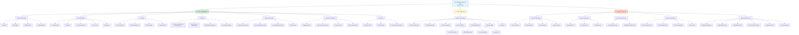

# Sơ Đồ Phân Cấp Chức Năng

```mermaid
graph TD
    System[Hệ Thống Bán Hàng Linh Kiện<br/>TDatPC.Store]
    
    System --> User[👤 User - Khách Hàng]
    System --> Staff[👨‍💼 Staff - Nhân Viên]
    System --> Admin[👨‍💻 Admin - Quản Trị]
    
    User --> U1[Quản Lý Tài Khoản]
    User --> U2[Xem Sản Phẩm]
    User --> U3[Giỏ Hàng]
    User --> U4[Đặt Hàng]
    User --> U5[Quản Lý Đơn Hàng]
    User --> U6[Build PC Thông Minh]
    User --> U7[Yêu Thích]
    
    U1 --> U1_1[Đăng ký]
    U1 --> U1_2[Đăng nhập]
    U1 --> U1_3[Đổi mật khẩu]
    U1 --> U1_4[Quên mật khẩu]
    
    U2 --> U2_1[Xem danh sách]
    U2 --> U2_2[Tìm kiếm]
    U2 --> U2_3[Lọc theo danh mục]
    U2 --> U2_4[Xem chi tiết]
    U2 --> U2_5[Phân trang]
    
    U3 --> U3_1[Thêm sản phẩm]
    U3 --> U3_2[Cập nhật số lượng]
    U3 --> U3_3[Xóa sản phẩm]
    U3 --> U3_4[Xem tổng tiền]
    
    U4 --> U4_1[Chọn phương thức nhận<br/>Pickup/Delivery]
    U4 --> U4_2[Chọn thanh toán<br/>COD/VNPay]
    U4 --> U4_3[Nhập địa chỉ giao hàng]
    U4 --> U4_4[Xác nhận đơn hàng]
    
    U5 --> U5_1[Xem lịch sử đơn hàng]
    U5 --> U5_2[Xem workflow trạng thái]
    U5 --> U5_3[Xác nhận đã nhận hàng]
    U5 --> U5_4[Liên hệ shop]
    
    U6 --> U6_1[Nhập ngân sách]
    U6 --> U6_2[Chọn mục đích sử dụng]
    U6 --> U6_3[Gợi ý cấu hình]
    U6 --> U6_4[Thêm vào giỏ hàng]
    
    U7 --> U7_1[Thêm yêu thích]
    U7 --> U7_2[Xóa yêu thích]
    U7 --> U7_3[Xem danh sách yêu thích]
    
    Staff --> S1[Quản Lý Đơn Hàng]
    
    S1 --> S1_1[Xem tất cả đơn hàng]
    S1 --> S1_2[Tìm kiếm đơn hàng]
    S1 --> S1_3[Lọc theo trạng thái]
    S1 --> S1_4[Xem chi tiết đơn]
    S1 --> S1_5[Cập nhật trạng thái]
    S1 --> S1_6[Hủy đơn hàng]
    S1 --> S1_7[In hóa đơn]
    
    S1_5 --> S1_5_1[Xác nhận sẵn sàng]
    S1_5 --> S1_5_2[Bắt đầu giao hàng]
    S1_5 --> S1_5_3[Xác nhận đã giao]
    S1_5 --> S1_5_4[Hoàn thành]
    
    Admin --> A1[Quản Lý Sản Phẩm]
    Admin --> A2[Quản Lý Danh Mục]
    Admin --> A3[Quản Lý Người Dùng]
    Admin --> A4[Quản Lý Đơn Hàng]
    Admin --> A5[Thống Kê & Báo Cáo]
    
    A1 --> A1_1[Thêm sản phẩm]
    A1 --> A1_2[Sửa sản phẩm]
    A1 --> A1_3[Xóa sản phẩm]
    A1 --> A1_4[Xem danh sách]
    
    A2 --> A2_1[Thêm danh mục]
    A2 --> A2_2[Sửa danh mục]
    A2 --> A2_3[Xóa danh mục]
    
    A3 --> A3_1[Xem danh sách user]
    A3 --> A3_2[Khóa/Mở khóa tài khoản]
    
    A4 --> A4_1[Xem tất cả đơn hàng]
    A4 --> A4_2[Tìm kiếm đơn hàng]
    A4 --> A4_3[Lọc theo trạng thái]
    A4 --> A4_4[Xem chi tiết]
    
    A5 --> A5_1[Dashboard tổng quan]
    A5 --> A5_2[Biểu đồ doanh thu]
    A5 --> A5_3[Biểu đồ đơn hàng]
    A5 --> A5_4[Top sản phẩm bán chạy]
    A5 --> A5_5[Người dùng mới]
    A5 --> A5_6[Lọc theo thời gian]
    
    style System fill:#e1f5ff
    style User fill:#c8e6c9
    style Staff fill:#fff9c4
    style Admin fill:#ffccbc
```
