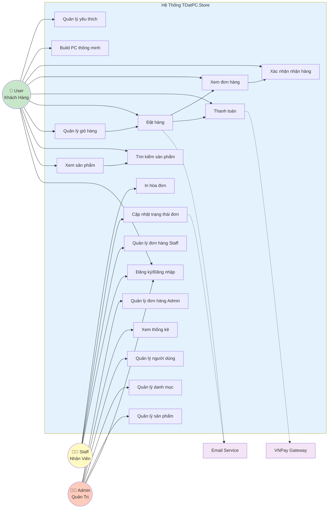

# Sơ Đồ Use Case Tổng Quát

## Mô tả Use Case

### Use Case User

| ID | Tên Use Case | Mô tả | Actor |
|----|--------------|-------|-------|
| UC1 | Đăng ký/Đăng nhập | User tạo tài khoản mới hoặc đăng nhập vào hệ thống | User, Staff, Admin |
| UC2 | Xem sản phẩm | Xem danh sách sản phẩm với phân trang | User |
| UC3 | Tìm kiếm sản phẩm | Tìm kiếm theo tên, lọc theo danh mục | User |
| UC4 | Quản lý giỏ hàng | Thêm, sửa, xóa sản phẩm trong giỏ | User |
| UC5 | Đặt hàng | Tạo đơn hàng mới với thông tin giao hàng | User |
| UC6 | Thanh toán | Chọn phương thức thanh toán COD/VNPay | User |
| UC7 | Xem đơn hàng | Xem lịch sử và trạng thái đơn hàng | User |
| UC8 | Xác nhận nhận hàng | Xác nhận đã nhận hàng thành công | User |
| UC9 | Build PC thông minh | Gợi ý cấu hình PC theo ngân sách | User |
| UC10 | Quản lý yêu thích | Lưu sản phẩm yêu thích | User |

### Use Case Staff

| ID | Tên Use Case | Mô tả | Actor |
|----|--------------|-------|-------|
| UC11 | Quản lý đơn hàng Staff | Xem, tìm kiếm, lọc đơn hàng | Staff |
| UC12 | Cập nhật trạng thái đơn | Cập nhật workflow đơn hàng | Staff |
| UC13 | In hóa đơn | In hóa đơn cho khách hàng | Staff |

### Use Case Admin

| ID | Tên Use Case | Mô tả | Actor |
|----|--------------|-------|-------|
| UC14 | Quản lý sản phẩm | CRUD sản phẩm | Admin |
| UC15 | Quản lý danh mục | CRUD danh mục sản phẩm | Admin |
| UC16 | Quản lý người dùng | Khóa/mở khóa tài khoản user | Admin |
| UC17 | Xem thống kê | Dashboard với biểu đồ doanh thu | Admin |
| UC18 | Quản lý đơn hàng Admin | Xem tất cả đơn hàng trong hệ thống | Admin |
