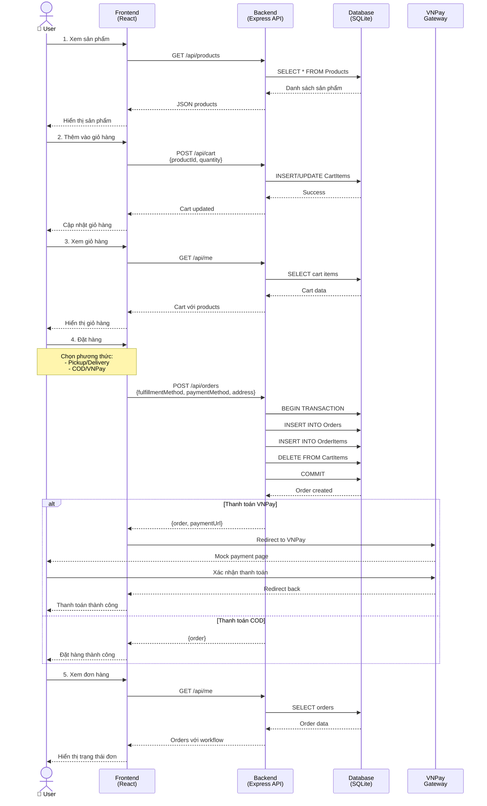

# Sơ Đồ Tuần Tự - Quy Trình Đặt Hàng

```mermaid
sequenceDiagram
    actor User as 👤 User
    participant FE as Frontend<br/>(React)
    participant BE as Backend<br/>(Express API)
    participant DB as Database<br/>(SQLite)
    participant VNPay as VNPay<br/>Gateway
    
    User->>FE: 1. Xem sản phẩm
    FE->>BE: GET /api/products
    BE->>DB: SELECT * FROM Products
    DB-->>BE: Danh sách sản phẩm
    BE-->>FE: JSON products
    FE-->>User: Hiển thị sản phẩm
    
    User->>FE: 2. Thêm vào giỏ hàng
    FE->>BE: POST /api/cart<br/>{productId, quantity}
    BE->>DB: INSERT/UPDATE CartItems
    DB-->>BE: Success
    BE-->>FE: Cart updated
    FE-->>User: Cập nhật giỏ hàng
    
    User->>FE: 3. Xem giỏ hàng
    FE->>BE: GET /api/me
    BE->>DB: SELECT cart items
    DB-->>BE: Cart data
    BE-->>FE: Cart với products
    FE-->>User: Hiển thị giỏ hàng
    
    User->>FE: 4. Đặt hàng
    Note over User,FE: Chọn phương thức:<br/>- Pickup/Delivery<br/>- COD/VNPay
    FE->>BE: POST /api/orders<br/>{fulfillmentMethod, paymentMethod, address}
    
    BE->>DB: BEGIN TRANSACTION
    BE->>DB: INSERT INTO Orders
    BE->>DB: INSERT INTO OrderItems
    BE->>DB: DELETE FROM CartItems
    BE->>DB: COMMIT
    DB-->>BE: Order created
    
    alt Thanh toán VNPay
        BE-->>FE: {order, paymentUrl}
        FE->>VNPay: Redirect to VNPay
        VNPay-->>User: Mock payment page
        User->>VNPay: Xác nhận thanh toán
        VNPay-->>FE: Redirect back
        FE-->>User: Thanh toán thành công
    else Thanh toán COD
        BE-->>FE: {order}
        FE-->>User: Đặt hàng thành công
    end
    
    User->>FE: 5. Xem đơn hàng
    FE->>BE: GET /api/me
    BE->>DB: SELECT orders
    DB-->>BE: Order data
    BE-->>FE: Orders với workflow
    FE-->>User: Hiển thị trạng thái đơn
```
