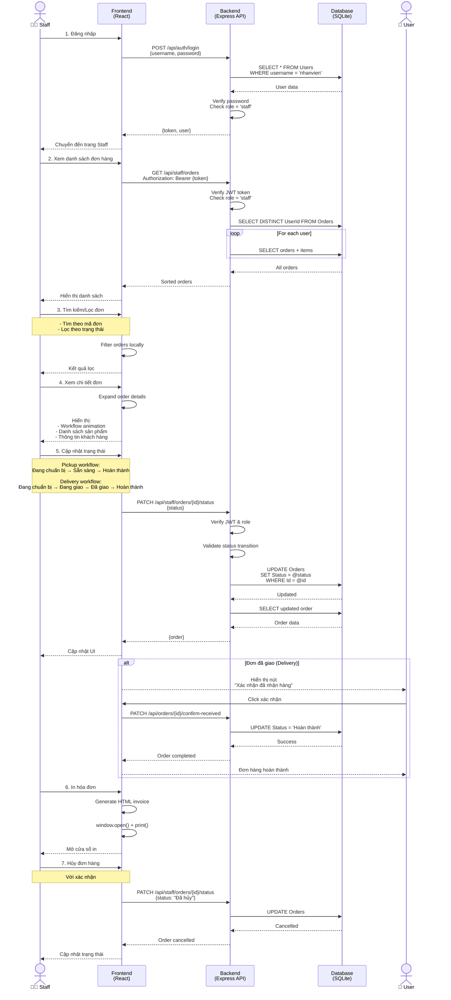

# Sơ Đồ Tuần Tự - Staff Xử Lý Đơn Hàng

```mermaid
sequenceDiagram
    actor Staff as 👨‍💼 Staff
    participant FE as Frontend<br/>(React)
    participant BE as Backend<br/>(Express API)
    participant DB as Database<br/>(SQLite)
    actor User as 👤 User
    
    Staff->>FE: 1. Đăng nhập
    FE->>BE: POST /api/auth/login<br/>{username, password}
    BE->>DB: SELECT * FROM Users<br/>WHERE username = 'nhanvien'
    DB-->>BE: User data
    BE->>BE: Verify password<br/>Check role = 'staff'
    BE-->>FE: {token, user}
    FE-->>Staff: Chuyển đến trang Staff
    
    Staff->>FE: 2. Xem danh sách đơn hàng
    FE->>BE: GET /api/staff/orders<br/>Authorization: Bearer {token}
    BE->>BE: Verify JWT token<br/>Check role = 'staff'
    BE->>DB: SELECT DISTINCT UserId FROM Orders
    loop For each user
        BE->>DB: SELECT orders + items
    end
    DB-->>BE: All orders
    BE-->>FE: Sorted orders
    FE-->>Staff: Hiển thị danh sách
    
    Staff->>FE: 3. Tìm kiếm/Lọc đơn
    Note over Staff,FE: - Tìm theo mã đơn<br/>- Lọc theo trạng thái
    FE->>FE: Filter orders locally
    FE-->>Staff: Kết quả lọc
    
    Staff->>FE: 4. Xem chi tiết đơn
    FE->>FE: Expand order details
    FE-->>Staff: Hiển thị:<br/>- Workflow animation<br/>- Danh sách sản phẩm<br/>- Thông tin khách hàng
    
    Staff->>FE: 5. Cập nhật trạng thái
    Note over Staff,FE: Pickup workflow:<br/>Đang chuẩn bị → Sẵn sàng → Hoàn thành<br/><br/>Delivery workflow:<br/>Đang chuẩn bị → Đang giao → Đã giao → Hoàn thành
    
    FE->>BE: PATCH /api/staff/orders/{id}/status<br/>{status}
    BE->>BE: Verify JWT & role
    BE->>BE: Validate status transition
    BE->>DB: UPDATE Orders<br/>SET Status = @status<br/>WHERE Id = @id
    DB-->>BE: Updated
    BE->>DB: SELECT updated order
    DB-->>BE: Order data
    BE-->>FE: {order}
    FE-->>Staff: Cập nhật UI
    
    alt Đơn đã giao (Delivery)
        FE-->>User: Hiển thị nút<br/>"Xác nhận đã nhận hàng"
        User->>FE: Click xác nhận
        FE->>BE: PATCH /api/orders/{id}/confirm-received
        BE->>DB: UPDATE Status = 'Hoàn thành'
        DB-->>BE: Success
        BE-->>FE: Order completed
        FE-->>User: Đơn hàng hoàn thành
    end
    
    Staff->>FE: 6. In hóa đơn
    FE->>FE: Generate HTML invoice
    FE->>FE: window.open() + print()
    FE-->>Staff: Mở cửa sổ in
    
    Staff->>FE: 7. Hủy đơn hàng
    Note over Staff,FE: Với xác nhận
    FE->>BE: PATCH /api/staff/orders/{id}/status<br/>{status: "Đã hủy"}
    BE->>DB: UPDATE Orders
    DB-->>BE: Cancelled
    BE-->>FE: Order cancelled
    FE-->>Staff: Cập nhật trạng thái
```
