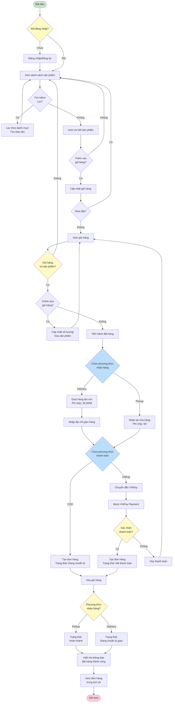

# Sơ Đồ Hoạt Động - Quy Trình Đặt Hàng

```mermaid
flowchart TD
    Start([Bắt đầu]) --> Login{Đã đăng nhập?}
    Login -->|Chưa| DoLogin[Đăng nhập/Đăng ký]
    DoLogin --> ViewProducts
    Login -->|Rồi| ViewProducts[Xem danh sách sản phẩm]
    
    ViewProducts --> Search{Tìm kiếm/<br/>Lọc?}
    Search -->|Có| FilterProducts[Lọc theo danh mục/<br/>Tìm theo tên]
    FilterProducts --> ViewProducts
    Search -->|Không| ViewDetail[Xem chi tiết sản phẩm]
    
    ViewDetail --> AddToCart{Thêm vào<br/>giỏ hàng?}
    AddToCart -->|Có| UpdateCart[Cập nhật giỏ hàng]
    UpdateCart --> ContinueShopping{Mua tiếp?}
    ContinueShopping -->|Có| ViewProducts
    ContinueShopping -->|Không| ViewCart
    AddToCart -->|Không| ViewProducts
    
    ViewCart[Xem giỏ hàng] --> CheckCart{Giỏ hàng<br/>có sản phẩm?}
    CheckCart -->|Không| ViewProducts
    CheckCart -->|Có| EditCart{Chỉnh sửa<br/>giỏ hàng?}
    
    EditCart -->|Có| UpdateQuantity[Cập nhật số lượng/<br/>Xóa sản phẩm]
    UpdateQuantity --> ViewCart
    EditCart -->|Không| Checkout[Tiến hành đặt hàng]
    
    Checkout --> SelectFulfillment{Chọn phương thức<br/>nhận hàng}
    SelectFulfillment -->|Pickup| SetPickup[Nhận tại cửa hàng<br/>Phí ship: 0đ]
    SelectFulfillment -->|Delivery| SetDelivery[Giao hàng tận nơi<br/>Phí ship: 30,000đ]
    
    SetDelivery --> EnterAddress[Nhập địa chỉ giao hàng]
    EnterAddress --> SelectPayment
    SetPickup --> SelectPayment{Chọn phương thức<br/>thanh toán}
    
    SelectPayment -->|COD| CreateOrderCOD[Tạo đơn hàng<br/>Trạng thái: Đang chuẩn bị]
    SelectPayment -->|VNPay| ProcessVNPay[Chuyển đến VNPay]
    
    ProcessVNPay --> VNPayMock[Mock VNPay Payment]
    VNPayMock --> ConfirmPayment{Xác nhận<br/>thanh toán?}
    ConfirmPayment -->|Có| CreateOrderVNPay[Tạo đơn hàng<br/>Trạng thái: Đã thanh toán]
    ConfirmPayment -->|Không| CancelPayment[Hủy thanh toán]
    CancelPayment --> ViewCart
    
    CreateOrderCOD --> ClearCart[Xóa giỏ hàng]
    CreateOrderVNPay --> ClearCart
    
    ClearCart --> CheckFulfillment{Phương thức<br/>nhận hàng?}
    CheckFulfillment -->|Pickup| SetStatusComplete[Trạng thái:<br/>Hoàn thành]
    CheckFulfillment -->|Delivery| SetStatusPreparing[Trạng thái:<br/>Đang chuẩn bị giao]
    
    SetStatusComplete --> ShowSuccess
    SetStatusPreparing --> ShowSuccess[Hiển thị thông báo<br/>đặt hàng thành công]
    
    ShowSuccess --> ViewOrders[Xem đơn hàng<br/>trong lịch sử]
    ViewOrders --> End([Kết thúc])
    
    style Start fill:#c8e6c9
    style End fill:#ffcdd2
    style Login fill:#fff9c4
    style CheckCart fill:#fff9c4
    style SelectFulfillment fill:#bbdefb
    style SelectPayment fill:#bbdefb
    style ConfirmPayment fill:#fff9c4
    style CheckFulfillment fill:#fff9c4
```
