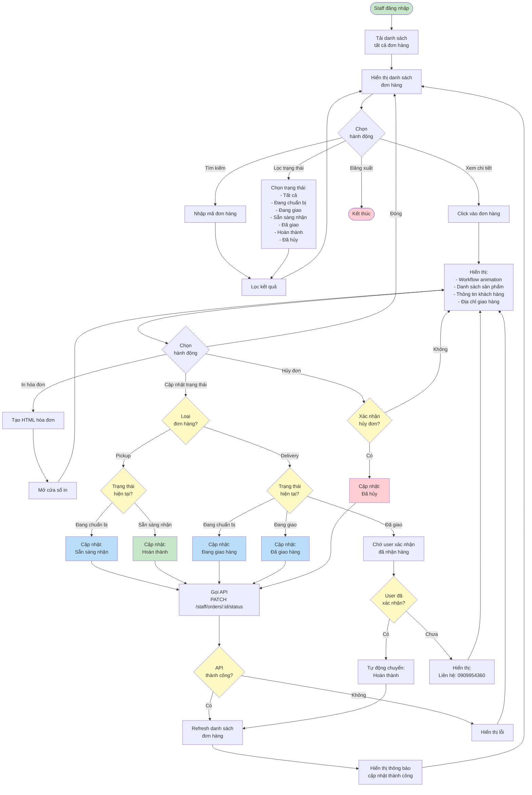

# Sơ Đồ Hoạt Động - Staff Xử Lý Đơn Hàng

```mermaid
flowchart TD
    Start([Staff đăng nhập]) --> LoadOrders[Tải danh sách<br/>tất cả đơn hàng]
    
    LoadOrders --> DisplayOrders[Hiển thị danh sách<br/>đơn hàng]
    
    DisplayOrders --> Action{Chọn<br/>hành động}
    
    Action -->|Tìm kiếm| SearchOrder[Nhập mã đơn hàng]
    SearchOrder --> FilterResults[Lọc kết quả]
    FilterResults --> DisplayOrders
    
    Action -->|Lọc trạng thái| SelectStatus[Chọn trạng thái:<br/>- Tất cả<br/>- Đang chuẩn bị<br/>- Đang giao<br/>- Sẵn sàng nhận<br/>- Đã giao<br/>- Hoàn thành<br/>- Đã hủy]
    SelectStatus --> FilterResults
    
    Action -->|Xem chi tiết| ViewDetail[Click vào đơn hàng]
    ViewDetail --> ShowDetail[Hiển thị:<br/>- Workflow animation<br/>- Danh sách sản phẩm<br/>- Thông tin khách hàng<br/>- Địa chỉ giao hàng]
    
    ShowDetail --> DetailAction{Chọn<br/>hành động}
    
    DetailAction -->|In hóa đơn| PrintInvoice[Tạo HTML hóa đơn]
    PrintInvoice --> OpenPrintWindow[Mở cửa sổ in]
    OpenPrintWindow --> ShowDetail
    
    DetailAction -->|Cập nhật trạng thái| CheckOrderType{Loại<br/>đơn hàng?}
    
    CheckOrderType -->|Pickup| CheckPickupStatus{Trạng thái<br/>hiện tại?}
    CheckPickupStatus -->|Đang chuẩn bị| UpdateToReady[Cập nhật:<br/>Sẵn sàng nhận]
    CheckPickupStatus -->|Sẵn sàng nhận| UpdateToComplete[Cập nhật:<br/>Hoàn thành]
    
    CheckOrderType -->|Delivery| CheckDeliveryStatus{Trạng thái<br/>hiện tại?}
    CheckDeliveryStatus -->|Đang chuẩn bị| UpdateToShipping[Cập nhật:<br/>Đang giao hàng]
    CheckDeliveryStatus -->|Đang giao| UpdateToDelivered[Cập nhật:<br/>Đã giao hàng]
    CheckDeliveryStatus -->|Đã giao| WaitUserConfirm[Chờ user xác nhận<br/>đã nhận hàng]
    
    UpdateToReady --> CallAPI[Gọi API<br/>PATCH /staff/orders/:id/status]
    UpdateToComplete --> CallAPI
    UpdateToShipping --> CallAPI
    UpdateToDelivered --> CallAPI
    
    CallAPI --> ValidateAPI{API<br/>thành công?}
    ValidateAPI -->|Có| RefreshOrders[Refresh danh sách<br/>đơn hàng]
    ValidateAPI -->|Không| ShowError[Hiển thị lỗi]
    ShowError --> ShowDetail
    
    RefreshOrders --> ShowSuccess[Hiển thị thông báo<br/>cập nhật thành công]
    ShowSuccess --> DisplayOrders
    
    WaitUserConfirm --> UserConfirmed{User đã<br/>xác nhận?}
    UserConfirmed -->|Có| AutoComplete[Tự động chuyển:<br/>Hoàn thành]
    UserConfirmed -->|Chưa| ShowContactInfo[Hiển thị:<br/>Liên hệ: 0909954360]
    ShowContactInfo --> ShowDetail
    AutoComplete --> RefreshOrders
    
    DetailAction -->|Hủy đơn| ConfirmCancel{Xác nhận<br/>hủy đơn?}
    ConfirmCancel -->|Có| UpdateToCancelled[Cập nhật:<br/>Đã hủy]
    ConfirmCancel -->|Không| ShowDetail
    UpdateToCancelled --> CallAPI
    
    DetailAction -->|Đóng| DisplayOrders
    
    Action -->|Đăng xuất| End([Kết thúc])
    
    style Start fill:#c8e6c9
    style End fill:#ffcdd2
    style CheckOrderType fill:#fff9c4
    style CheckPickupStatus fill:#fff9c4
    style CheckDeliveryStatus fill:#fff9c4
    style ValidateAPI fill:#fff9c4
    style ConfirmCancel fill:#fff9c4
    style UserConfirmed fill:#fff9c4
    style UpdateToReady fill:#bbdefb
    style UpdateToShipping fill:#bbdefb
    style UpdateToDelivered fill:#bbdefb
    style UpdateToComplete fill:#c8e6c9
    style UpdateToCancelled fill:#ffcdd2
```
