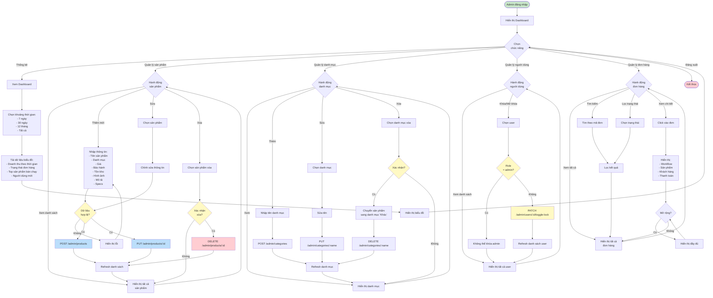

# Sơ Đồ Hoạt Động - Admin Quản Lý Hệ Thống

```mermaid
flowchart TD
    Start([Admin đăng nhập]) --> Dashboard[Hiển thị Dashboard]
    
    Dashboard --> Menu{Chọn<br/>chức năng}
    
    Menu -->|Thống kê| ViewStats[Xem Dashboard]
    ViewStats --> SelectTimeRange[Chọn khoảng thời gian:<br/>- 7 ngày<br/>- 30 ngày<br/>- 12 tháng<br/>- Tất cả]
    SelectTimeRange --> LoadCharts[Tải dữ liệu biểu đồ:<br/>- Doanh thu theo thời gian<br/>- Trạng thái đơn hàng<br/>- Top sản phẩm bán chạy<br/>- Người dùng mới]
    LoadCharts --> DisplayCharts[Hiển thị biểu đồ]
    DisplayCharts --> Menu
    
    Menu -->|Quản lý sản phẩm| ProductMenu{Hành động<br/>sản phẩm}
    
    ProductMenu -->|Xem danh sách| ListProducts[Hiển thị tất cả<br/>sản phẩm]
    ListProducts --> ProductMenu
    
    ProductMenu -->|Thêm mới| AddProductForm[Nhập thông tin:<br/>- Tên sản phẩm<br/>- Danh mục<br/>- Giá<br/>- Bảo hành<br/>- Tồn kho<br/>- Hình ảnh<br/>- Mô tả<br/>- Specs]
    AddProductForm --> ValidateProduct{Dữ liệu<br/>hợp lệ?}
    ValidateProduct -->|Không| ShowProductError[Hiển thị lỗi]
    ShowProductError --> AddProductForm
    ValidateProduct -->|Có| CreateProduct[POST /admin/products]
    CreateProduct --> RefreshProducts[Refresh danh sách]
    RefreshProducts --> ListProducts
    
    ProductMenu -->|Sửa| SelectProduct[Chọn sản phẩm]
    SelectProduct --> EditProductForm[Chỉnh sửa thông tin]
    EditProductForm --> ValidateProduct
    ValidateProduct -->|Có| UpdateProduct[PUT /admin/products/:id]
    UpdateProduct --> RefreshProducts
    
    ProductMenu -->|Xóa| SelectProductDelete[Chọn sản phẩm xóa]
    SelectProductDelete --> ConfirmDelete{Xác nhận<br/>xóa?}
    ConfirmDelete -->|Không| ListProducts
    ConfirmDelete -->|Có| DeleteProduct[DELETE /admin/products/:id]
    DeleteProduct --> RefreshProducts
    
    Menu -->|Quản lý danh mục| CategoryMenu{Hành động<br/>danh mục}
    
    CategoryMenu -->|Xem| ListCategories[Hiển thị danh mục]
    ListCategories --> CategoryMenu
    
    CategoryMenu -->|Thêm| AddCategoryForm[Nhập tên danh mục]
    AddCategoryForm --> CreateCategory[POST /admin/categories]
    CreateCategory --> RefreshCategories[Refresh danh mục]
    RefreshCategories --> ListCategories
    
    CategoryMenu -->|Sửa| SelectCategory[Chọn danh mục]
    SelectCategory --> EditCategoryForm[Sửa tên]
    EditCategoryForm --> UpdateCategory[PUT /admin/categories/:name]
    UpdateCategory --> RefreshCategories
    
    CategoryMenu -->|Xóa| SelectCategoryDelete[Chọn danh mục xóa]
    SelectCategoryDelete --> ConfirmCategoryDelete{Xác nhận?}
    ConfirmCategoryDelete -->|Có| MoveToCategoryOther[Chuyển sản phẩm<br/>sang danh mục 'Khác']
    MoveToCategoryOther --> DeleteCategory[DELETE /admin/categories/:name]
    DeleteCategory --> RefreshCategories
    ConfirmCategoryDelete -->|Không| ListCategories
    
    Menu -->|Quản lý người dùng| UserMenu{Hành động<br/>người dùng}
    
    UserMenu -->|Xem danh sách| ListUsers[Hiển thị tất cả user]
    ListUsers --> UserMenu
    
    UserMenu -->|Khóa/Mở khóa| SelectUser[Chọn user]
    SelectUser --> CheckUserRole{Role<br/>= admin?}
    CheckUserRole -->|Có| ShowAdminError[Không thể khóa admin]
    ShowAdminError --> ListUsers
    CheckUserRole -->|Không| ToggleLock[PATCH /admin/users/:id/toggle-lock]
    ToggleLock --> RefreshUsers[Refresh danh sách user]
    RefreshUsers --> ListUsers
    
    Menu -->|Quản lý đơn hàng| AdminOrderMenu{Hành động<br/>đơn hàng}
    
    AdminOrderMenu -->|Xem tất cả| ListAllOrders[Hiển thị tất cả<br/>đơn hàng]
    ListAllOrders --> AdminOrderMenu
    
    AdminOrderMenu -->|Tìm kiếm| SearchAdminOrder[Tìm theo mã đơn]
    SearchAdminOrder --> FilterAdminResults[Lọc kết quả]
    FilterAdminResults --> ListAllOrders
    
    AdminOrderMenu -->|Lọc trạng thái| SelectAdminStatus[Chọn trạng thái]
    SelectAdminStatus --> FilterAdminResults
    
    AdminOrderMenu -->|Xem chi tiết| ViewAdminOrderDetail[Click vào đơn]
    ViewAdminOrderDetail --> ShowAdminOrderDetail[Hiển thị:<br/>- Workflow<br/>- Sản phẩm<br/>- Khách hàng<br/>- Thanh toán]
    ShowAdminOrderDetail --> ExpandOrder{Mở rộng?}
    ExpandOrder -->|Có| ShowFullDetail[Hiển thị đầy đủ]
    ShowFullDetail --> ExpandOrder
    ExpandOrder -->|Không| ListAllOrders
    
    Menu -->|Đăng xuất| End([Kết thúc])
    
    style Start fill:#c8e6c9
    style End fill:#ffcdd2
    style ValidateProduct fill:#fff9c4
    style ConfirmDelete fill:#fff9c4
    style ConfirmCategoryDelete fill:#fff9c4
    style CheckUserRole fill:#fff9c4
    style CreateProduct fill:#bbdefb
    style UpdateProduct fill:#bbdefb
    style DeleteProduct fill:#ffcdd2
    style ToggleLock fill:#fff9c4
```
